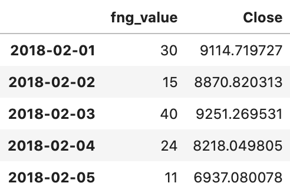
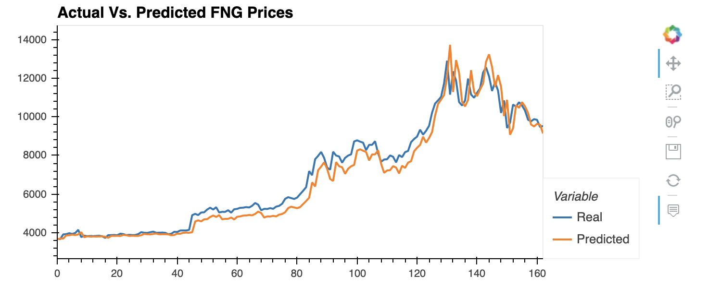
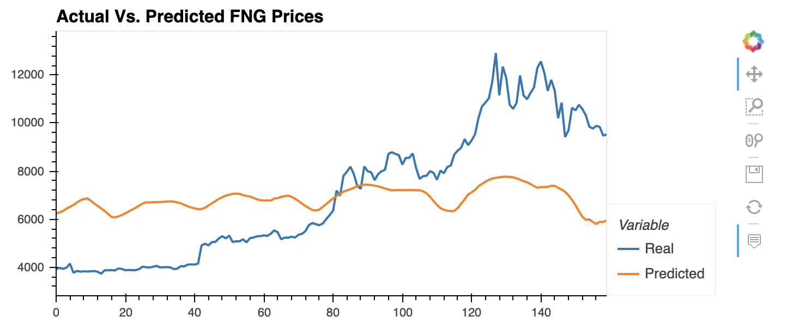

# Stock Predictor - LSTM 


## Problem Statement
Due to the volatility of cryptocurrency speculation, investors will often try to incorporate sentiment from social media and news articles to help guide their trading strategies. One such indicator is the [Crypto Fear and Greed Index (FNG)](https://alternative.me/crypto/fear-and-greed-index/) which attempts to use a variety of data sources to produce a daily FNG value for cryptocurrency. You have been asked to help build and evaluate deep learning models using both the FNG values and simple closing prices to determine if the FNG indicator provides a better signal for cryptocurrencies than the normal closing price data.

Using deep learning recurrent neural networks to model bitcoin closing prices. One model will use the FNG indicators to predict the closing price while the second model will use a window of closing prices to predict the nth closing price.

You will need to:

1. [Prepare the data for training and testing](#prepare-the-data-for-training-and-testing)
2. [Build and train custom LSTM RNNs](#build-and-train-custom-lstm-rnns)
3. [Evaluate the performance of each model](#evaluate-the-performance-of-each-model)

- - -

### Files

[Closing Prices Starter Notebook](Starter_Code/lstm_stock_predictor_closing.ipynb)

[FNG Starter Notebook](Starter_Code/lstm_stock_predictor_fng.ipynb)

- - -

## Instructions

### Prepare the data for training and testing

* Use the starter code as a guide to create a Jupyter Notebook for each RNN. The starter code contains a function to help window the data for each dataset.

    - For the Fear and Greed model, using the FNG values to try and predict the closing price. 
    
    - For the closing price model, using previous closing prices to try and predict the next closing price. 
    
      

* Each model will need to use 70% of the data for training and 30% of the data for testing.<br>

```python
    # Predict Closing Prices using a 10 day window of fear and greed index values and a target of the 11th day closing price
    window_size = 1
    # Column index 0 is the 'FNG' & Column index 1 is the `Close` column 
    feature_column = 0
    target_column = 1
    X, y = window_data(df, window_size, feature_column, target_column)

    split = int(0.7 * len(X))
    X_train = X[: split - 1]
    X_test = X[split:]
    y_train = y[: split - 1]
    y_test = y[split:]
```

* Apply a MinMaxScaler to the X and y values to scale the data for the model.<br>

```python
    # Use MinMaxScaler to scale the data between 0 and 1. Importing the MinMaxScaler from sklearn
    from sklearn.preprocessing import MinMaxScaler
    # Create a MinMaxScaler object
    scaler = MinMaxScaler()
    # Fit the MinMaxScaler object with the features data X
    scaler.fit(X)
    # Scale the features training and testing sets
    X_train = scaler.transform(X_train)
    X_test = scaler.transform(X_test)
    # Fit the MinMaxScaler object with the target data Y
    scaler.fit(y)
    # Scale the target training and testing sets
    y_train = scaler.transform(y_train)
    y_test = scaler.transform(y_test)
```

* Finally, reshape the X_train and X_test values to fit the model's requirement of (samples, time steps, features).<br>

```python
    # Reshape the features for the model
    X_train = X_train.reshape((X_train.shape[0], X_train.shape[1], 1))
    X_test = X_test.reshape((X_test.shape[0], X_test.shape[1], 1))
```


### Build and train custom LSTM RNNs

    
1. Import the required library from tensorflow</br>
    
```python
    from tensorflow.keras.models import Sequential
    from tensorflow.keras.layers import LSTM, Dense, Dropout
```
2. Define the model architecture</br>
   
```python
    # Build the LSTM model. 

    model = Sequential()

    number_units = 30
    dropout_fraction = 0.2
    # The return sequences need to be set to True if you are adding additional LSTM layers, but don't have to do this for the final layer. 
    # Layer 1
    model.add(LSTM(
        units=number_units,
        return_sequences=True,
        input_shape=(X_train.shape[1], 1))
        )
    model.add(Dropout(dropout_fraction))
    # Layer 2
    model.add(LSTM(units=number_units, return_sequences=True))
    model.add(Dropout(dropout_fraction))
    # Layer 3
    model.add(LSTM(units=number_units))
    model.add(Dropout(dropout_fraction))
    # Output layer
    model.add(Dense(1))
```
3. Compile the model</br>
   
```python
   model.compile(optimizer="adam", loss="mean_squared_error")
```
4. Fit the model and train the data</br>

```python
    # Train the model
    # Use at least 10 epochs
    # Do not shuffle the data
    # Experiement with the batch size, but a smaller batch size is recommended
    model.fit(X_train, y_train, epochs=10, shuffle=False, batch_size=5, verbose=1)
```  
    
 | Closing Price                       | FNG                              |
 | ----------------------------------- | ----------------------------------- |
 | 0.003627717130720341                | 0.07386980955403276                 |
 |   |   |
 
 
 
### Evaluate the performance of each model

Finally, use the testing data to evaluate each model and compare the performance.

Use the above to answer the following:

> Which model has a lower loss?
> ```python
>   LSTM with Closing price
> ```
> Which model tracks the actual values better over time?
> ```python
>   LSTM with Closing price
> ```
> Which window size works best for the model?
> ```python
>   window_size = 1
> ```

- - -

### Resources

[Keras Sequential Model Guide](https://keras.io/getting-started/sequential-model-guide/)

[Illustrated Guide to LSTMs](https://towardsdatascience.com/illustrated-guide-to-lstms-and-gru-s-a-step-by-step-explanation-44e9eb85bf21)

[Stanford's RNN Cheatsheet](https://stanford.edu/~shervine/teaching/cs-230/cheatsheet-recurrent-neural-networks)

- - -

### Hints and Considerations

Experiment with the model architecture and parameters to see which provides the best results, but be sure to use the same architecture and parameters when comparing each model.

For training, use at least 10 estimators for both models.

- - -
